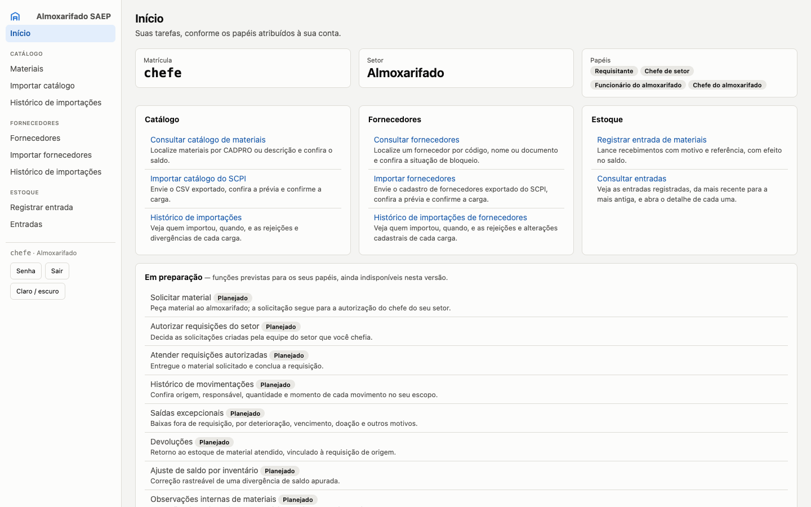
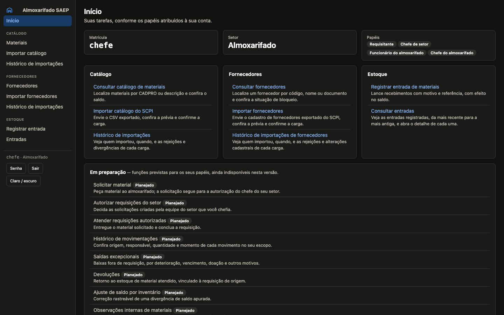
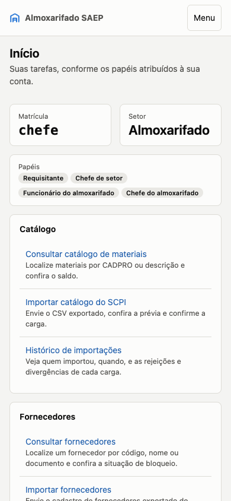
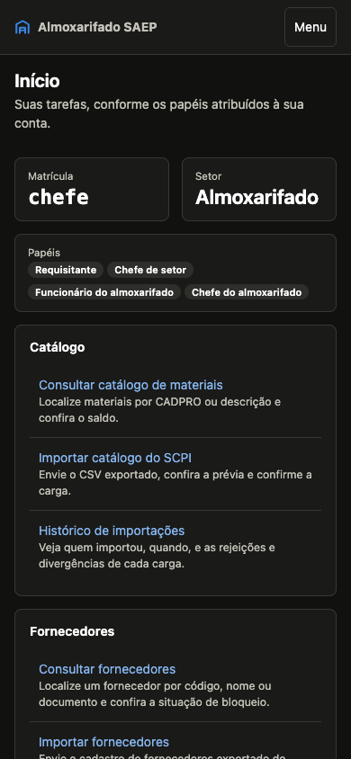
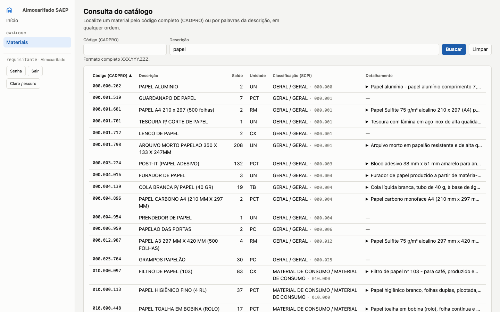
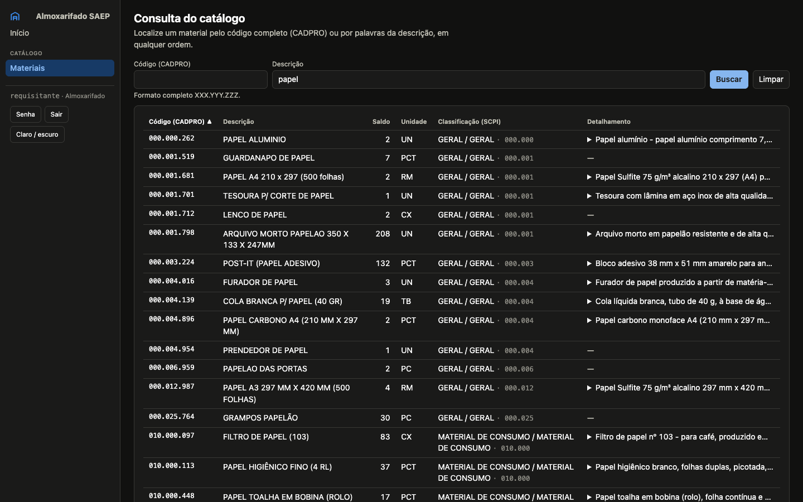
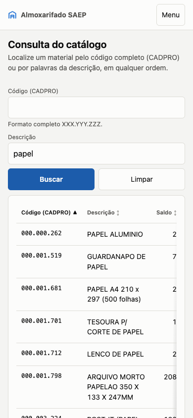
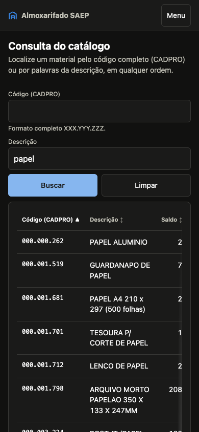

# Checkpoint humano — laboratório do redesign

Data: 2026-10-05. **Aguardando aceite visual explícito do dono do produto.** Este checkpoint
entrega shell compartilhado, Home e consulta do catálogo. A propagação P1–P6 permanece parada.
Working tree preservado, sem commit, push, merge, rebase ou troca de branch.

## Resultado construído

O shell autenticado usa sidebar de 216 px no desktop, destinos montados no servidor por
capability e um único rodapé de conta com Senha, logout POST/CSRF e tema. Até 860 px, a marca e
o botão Menu ficam numa barra estática, com navegação em fluxo e alvos de 44 px. A credencial
provisória mantém apenas marca sem link e controles da conta; o login ainda é a composição
legada, prevista para P1.

Home reúne identidade real em tiles, tarefas pelos mesmos destinos da sidebar e capacidades
planejadas sem links. A consulta reúne filtros, tabela e paginação na gramática do upstream,
preservando CADPRO, classificação, detalhes, filtros/ordenação/paginação e contratos HTMX.
Claro/escuro seguem o sistema ou a preferência persistida. Atkinson e a barra autenticada antiga
foram removidas; a fonte é a do sistema.

Na retomada, R1/R2 foram conferidos e V1–V6 passaram por veredito independente. V3 exigiu a
segunda rodada: mínimo de 16rem na Classificação conserva o conjunto curto numa linha no tablet.
“Em preparação” em uma coluna foi aceita pelo gate e registrada no contrato §12: título e selo
juntos, descrição abaixo. Essa composição está incluída no aceite visual solicitado aqui.

## Capturas para aceite

Chrome 154.0.8037.97 no macOS. Desktop: 1440×900; celular: 390×844 com toque. As imagens abaixo
são o primeiro viewport; os links “página completa” permitem conferir o restante. Home como
`chefe-almoxarifado`; catálogo como `requisitante`, busca `descricao=papel`.

| Superfície | Claro | Escuro |
|---|---|---|
| Home — desktop |  |  |
| Home — celular |  |  |
| Catálogo — desktop |  |  |
| Catálogo — celular |  |  |

As oito imagens acima estão versionadas em `capturas/`. As demais evidências citadas neste
documento por nome de arquivo (páginas completas, matriz de 44 cenários, `captures.json`, logs de
verificação, `interacoes.json`, `detect.json`) ficam em `.impeccable/review/`, pasta local
ignorada pelo git; regenere-as com `capturar.mjs` (servidor de desenvolvimento e login simulado,
ver o cabeçalho do script).

Páginas completas: Home desktop claro (`desktop.png`),
desktop escuro (`home-chefe-1440-escuro.png`),
celular claro (`mobile.png`),
celular escuro (`home-chefe-390-escuro.png`);
catálogo desktop claro (`catalogo-1440-claro.png`),
desktop escuro (`catalogo-1440-escuro.png`),
celular claro (`catalogo-390-claro.png`),
celular escuro (`catalogo-390-escuro.png`).

A matriz completa tem 44 cenários, com full-page e viewport (88 PNGs), incluindo 1280×800,
tablet 820×1180, menu aberto, código inválido, nenhum resultado, identidade provisória e telas
herdadas nos dois temas. Manifesto: `captures.json`.
Nenhum cenário apresentou overflow horizontal da página; tabelas largas rolam no próprio wrapper.

## Navegação por identidade

| Captura / identidade | Destinos observados na sidebar |
|---|---|
| Chefe do almoxarifado (`desktop.png`) | Início; Materiais; Importar catálogo; Histórico do catálogo; Fornecedores; Importar fornecedores; Histórico de fornecedores; Registrar entrada; Entradas |
| Requisitante (`home-requisitante-1440.png`) | Início; Materiais |
| Auditor (`home-auditor-1440.png`) | Início; Materiais; Entradas |
| Administrador de sistema (`home-admin-1440.png`) | Início; Materiais; Usuários; Setores |
| Sem papel de negócio — superusuário técnico (`home-sem-papel-1440.png`) | Apenas Início; nenhuma tarefa de negócio |
| Credencial provisória (`provisoria-1440.png`) | Sem navegação; marca sem link, Senha, Sair e tema |

Os menus refletem papéis explícitos das contas locais, inclusive Requisitante quando atribuído;
nenhum destino é concedido por herança administrativa. Rotas mantêm sua autorização de servidor.
Cada página autenticada capturada contém um único `<main>`, uma sidebar e um formulário de logout
POST com CSRF. Fragmentos HTMX foram conferidos sem shell/scripts.

## Comparação objetiva com a referência

Autoridade: django-observatory 0.1.0, commit `6edda16667c8a8601670f76e3286f86bed16e37d`.
`upstream/app.css`, `dashboard.png`, `request.png`, `logs.png` e `database-dark.png` estão em
`.impeccable/review/upstream/`. A tabela completa de valores computados está no plano §5;
`captures.json` reconfirma corpo, geometria, tema e navegação na retomada.

| Elemento | Upstream | WMS |
|---|---|---|
| Corpo | 14 px, entrelinha 1,45, system-ui | 14 px / 20,3 px, mesma pilha |
| Sidebar desktop | 216 px; padding 14×10 px | 216 px, mesmo padding |
| Coluna principal | padding 18×24×48 px, sem teto | mesmo valor e largura restante |
| Título | 1,45rem, peso 650 | 20,3 px, peso 650 |
| Card | raio 8 px; padding 14×16 px; borda 1 px | mesmos valores |
| Controle desktop | 30 px mínimos; raio 6 px; padding 5×10 px | mesmos valores |
| Célula desktop | padding 6×10 px, números tabulares | mesmos valores |
| Claro | fundo #f4f4f2; superfície #fcfcfb; borda #dddcd6; ação #1c5cab | mesmos tokens |
| Escuro | fundo #111110; superfície #1a1a19; borda #383835; ação #86b6ef | mesmos tokens |

A fonte de sistema resolve para SF Pro no macOS e Ubuntu nas capturas do upstream: tamanho,
peso e entrelinha coincidem, mas os glifos não são idênticos. Conteúdo e número de colunas do WMS
determinam a altura final das tabelas; a comparação não promete páginas de conteúdo idêntico.

## Diferenças deliberadas

As 14 diferenças do contrato §13 permanecem: idioma/marca/glifo próprios; exclusão de telemetria,
Live/gráficos/exports/intervalo/contadores; rodapé de conta; labels/dicas/erros visíveis;
paginação numerada; Menu e densidade de toque; tema inline antes da pintura; estados derivados
que o WMS requer; ordenação ▲/▼; remoção da Atkinson; ↕ sem hover; navegação montada no servidor;
texto desabilitado com `--text-2`; links em prosa sublinhados. A célula única de “Em preparação”
é a adaptação adicional de composição registrada no §12, aceita no gate e sujeita ao checkpoint.

## Verificações e reviews

- `make verify` final: **2969 passed, 3 skipped**, exit 0, 111,53 s. Lock, ruff e checks Django
  (inclusive produção/deploy) passaram. Log completo (`verify-final.log`).
- Chrome via CDP: dez verificações passaram — tema nos dois sentidos, reload/persistência,
  ordenação, paginação/foco, voltar/avançar e shell único, código inválido no servidor via HTMX,
  menu, Escape/foco e shell sem JS. Evidência (`interacoes.json`).
- `code_reviewer` da L9: nenhum finding relevante; não realizou auditoria estética.
- Finish review: rodada 1 `fix` por V3 parcial; rodada 2 **`ship` somente para V1–V6**, todos
  resolvidos, sem regressões identificadas. [Relatório](reviews-laboratorio.md).
- `DESIGN.md` e sidecar documentam o código final; fonte efetiva dos tiles registrada como
  1,6rem, sem transformar a declaração mobile sobrescrita numa promessa de design.
- Detector final: nove avisos consultivos e nenhum finding determinístico. Os templates Django
  não permitem resolver os links `` nessa análise; CSS foi incluído explicitamente
  e a saída real foi conferida no navegador. Resultados (`detect.json`).

## Pendências e limites

Não há P0/P1 nem finding visual material de V1–V6 aberto. O aceite humano deste laboratório
ainda está pendente. Gates desse lote não aprovam automaticamente a propagação.

- Scroll interno de 60vh em tabelas herdadas: preexistente, revisão em P2.
- Login ainda com barra/composição antiga: P1. Formulários de senha tiveram compatibilidade de
  shell conferida, mas sua recomposição também é P1.
- Páginas próprias 403/404/500 não existem; criá-las exige decisão do dono do produto.
- Prompts dos agentes e referências históricas a Atkinson em specs/memórias: P6. PRODUCT.md ainda
  menciona a direção antiga na evidência visual; não foi reescrito nesta entrega de apresentação.
- Três testes com CSV real ficaram pulados: catálogo, fornecedores e seed. Isso não valida
  automaticamente o aceite funcional das importações.
- Matriz executada em Chrome no macOS; sem evidência equivalente em outros motores. A consulta
  de entradas herdada foi capturada vazia; os fluxos críticos completos continuam para P4.
- Em 320 px, o auto-fit pode dar uma coluna de tiles; essa largura não integra a matriz. Não há
  promessa de duas colunas abaixo da largura mínima necessária. A fonte mobile sobrescrita é
  drift de baixo impacto conhecido, sem ciclo novo de correção.

## Arquivos do laboratório

Fundação e shell: `static/css/tokens.css`, `base.css`, `components.css`; novo `static/js/shell.js`;
`contas/templates/contas/base.html`, `home.html`, `senha.html` e novo `_navegacao.html`.
Navegação: novos `contas/navegacao.py`, `context_processors.py`; `contas/views.py` e
`config/settings/base.py`.

Consulta/compatibilidade: `catalogo/templates/catalogo/consulta.html`, `catalogo.css`,
`estoque.css`, `fornecedores.css`; parciais `interface/_consulta_falha.html`, `_mensagens.html`,
`_paginacao.html`, `_th_ordenavel.html`.

Testes: novos `test_navegacao.py`, `test_shell.py`, `html_helpers.py`, `test_html_helpers.py`;
`test_contas_home_papeis.py`, `test_contas_views_organizacao.py`. Removidos
`test_barra_trabalho.py`, `_barra_trabalho.html`, `home.css`, `fonts.css`, os dois WOFF2 da
Atkinson e respectivos avisos OFL.

Documentação: `DESIGN.md`, `.impeccable/design.json`, surface brief; ADR 0001/README e novo ADR
0002; `THIRD-PARTY-NOTICES.md`; `docs/redesign-observatory/contrato.md`, `plano.md`, este
checkpoint, `reviews-laboratorio.md` e `capturar.mjs`. Evidências locais em `.impeccable/review/`.
Na retomada, a única correção adicional de produção foi o mínimo da Classificação em `catalogo.css`.

## Plano restante, condicionado ao aceite

| Lote | Entrega |
|---|---|
| P1 | Login, troca voluntária e definição de senha |
| P2 | Fornecedores, históricos e detalhes de importação |
| P3 | Envio, prévia e confirmação/cancelamento das importações |
| P4 | Entradas, composição, confirmação, detalhe e estorno |
| P5 | Usuários, papéis, setores, chefias e confirmações |
| P6 | Remover CSS/encaixes legados, atualizar prompts espelhados e documentação final |

Cada lote repete testes, review funcional, gate visual nas identidades corretas e documentação.
**Parada vigente: este checkpoint.**
